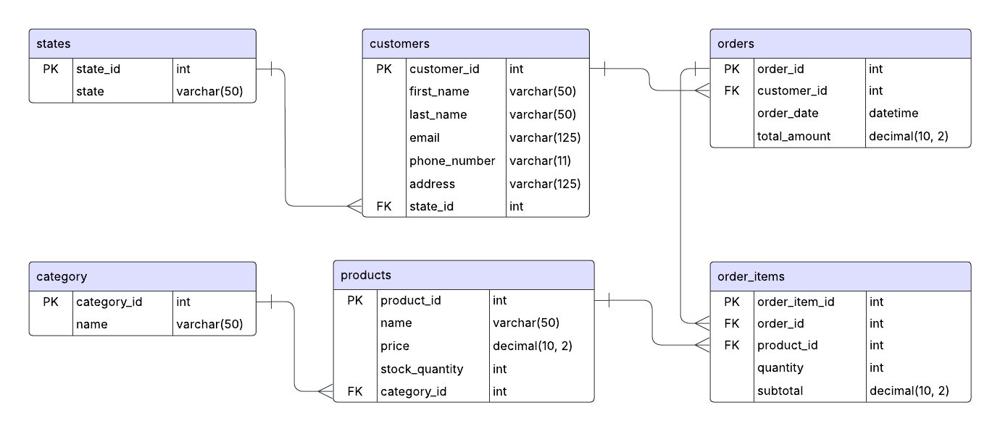

# 📌 E-commerce Sales Analysis Using MySQL
## 📚 Index
1. <a href="Project Overview">Project Overview<a>
2. 
3.
4.
5.

## 💡 Project Overview
The e-commerce website "Next Closet" operates across Australia, offering a wide range of products to customers nationwide. The company is exploring new campaign strategies to boost sales. My role is to analyze the provided data using MySQL and Tableau, and provide actionable recommendations on how to structure and execute these campaigns effectively, based on insights from the data.

## 📂 ERD
The current database have these tables.

## 📂 Databse Schema
